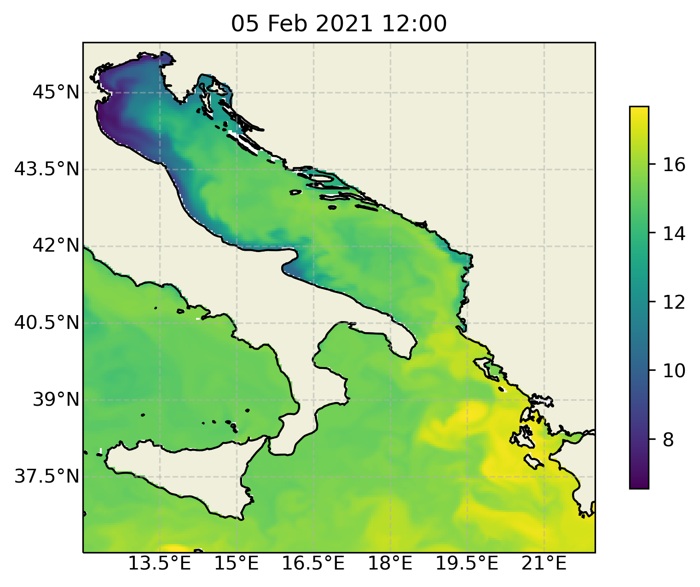
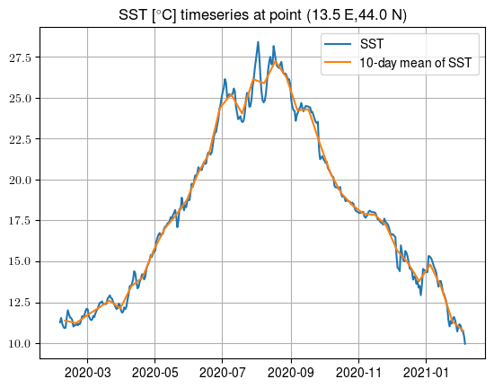
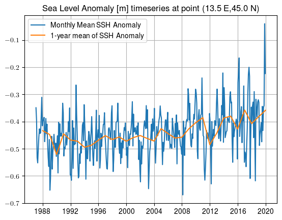

# CMEMS_data

Copernicus Marine Environment Monitoring Service  (CMEMS) data retrieval and plotting.

# Data retrieval requirements

* User account at https://marine.copernicus.eu/
* Python [2.7, 3.6 or 3.7]
* Python packages numpy, pandas, matplotlib, netCDF4, cartopy
* Motuclient [1.8 or higher] (https://marine.copernicus.eu/faq/what-are-the-motu-and-python-requirements/?idpage=169)

# Data retrieval example

## Retrieving a single step
Let's retrieve sea surface temperature (SST) from forecast MEDSEA_ANALYSIS_FORECAST_PHY_006_013-TDS in limited space-time domain. (All available products are listed [here](https://resources.marine.copernicus.eu/?option=com_csw&task=results&pk_vid=bf878f3427bd2be11611821870684780)).

After installing Motuclient, execute from command line:

```motuclient --motu http://nrt.cmems-du.eu/motu-web/Motu --service-id MEDSEA_ANALYSIS_FORECAST_PHY_006_013-TDS --product-id med00-cmcc-tem-an-fc-d --longitude-min 12 --longitude-max 22 --latitude-min 36 --latitude-max 45.97916793823242 --date-min "2021-02-05 12:00:00" --date-max "2021-02-05 12:00:00" --depth-min 1.0181 --depth-max 1.0184 --variable thetao --out-dir OUTFILE_DIR --out-name tmp.nc --user USERNAME --pwd PASSWORD```

This should initiate a download of a NetCDF file with the desired data.

## Retrieving a timeseries

To retrieve a longer timeseries, simply modify the time window in the query:

```motuclient --motu http://nrt.cmems-du.eu/motu-web/Motu --service-id MEDSEA_ANALYSIS_FORECAST_PHY_006_013-TDS --product-id med00-cmcc-tem-an-fc-d --longitude-min 12 --longitude-max 22 --latitude-min 36 --latitude-max 45.97916793823242 --date-min "2020-02-05 12:00:00" --date-max "2021-02-05 12:00:00" --depth-min 1.0181 --depth-max 1.0184 --variable thetao --out-dir . --out-name tmp_1yr.nc --user USERNAME --pwd PASSWORD```

## Retrieveing multidecadal reanalysis

Select appropriate reanalysis product [here](https://resources.marine.copernicus.eu/?option=com_csw&task=results&pk_vid=bf878f3427bd2be11611821870684780)), for example MEDSEA_MULTIYEAR_PHY_006_004-TDS. Then from the terminal:

```motuclient --motu http://my.cmems-du.eu/motu-web/Motu --service-id MEDSEA_MULTIYEAR_PHY_006_004-TDS --product-id med-cmcc-ssh-rean-m --longitude-min 13 --longitude-max 14 --latitude-min 44 --latitude-max 45.97916793823242 --date-min "1987-01-16 12:00:00" --date-max "2019-12-16 12:00:00" --variable zos --out-dir $PWD --out-name rean.nc --user USERNAME --pwd PASSWORD```

This will initiate a download of parameter `zos` (sea surface height) in a time-window `--date-min "1987-01-16 12:00:00"` to `--date-max "2019-12-16 12:00:00"`. The temporary file in this example will be saved as `rean.nc`.

# Data plotting examples

## Plot 2d SST field

See code `plot_CMEMS_field.py`. Executing this code should produce the following plot:



## Plot SST timeseries

See code `plot_CMEMS_timeseries.py`. Executing this code should produce the following plot:



## Plot Sea Level Reanalysis timeseries

See code `plot_CMEMS_reanalysis.py`. Executing this code should produce the following plot:

